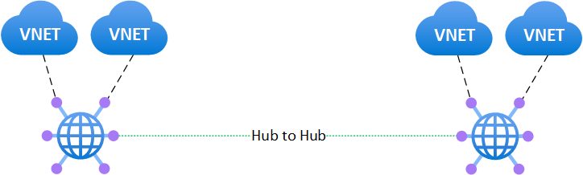

# Challenge 1

**[Home](../README.md)** - [Next Challenge >](./02_branch_connectivity.md)

## Introduction

In this challenge, you will create a Virtual WAN with two hubs and connect spoke VNets to them. It will establish full mesh connectivity in a multi-hub scenario. This will be the foundation for more complex scenario's in future challenges.

## Description

* Extend existing Virtual WAN by adding another hub (without VPN GW).
* Create 4 VNETs and connect two of them to every hub as their spoke VNETs.
* In each spoke VNet, create at least one subnet and deploy a virtual machine into it.
* Test communication between all VMs (ping, SSH/RDP).

Sample topology:

## Success Criteria

* Make sure Virtual Machines from different VNets on different hubs can communicate

## Learning Resources

* [What is Virtual WAN?](https://learn.microsoft.com/en-us/azure/virtual-wan/virtual-wan-about)
* [Virtual WAN any-to-any across hubs](https://docs.microsoft.com/azure/virtual-wan/scenario-any-to-any)