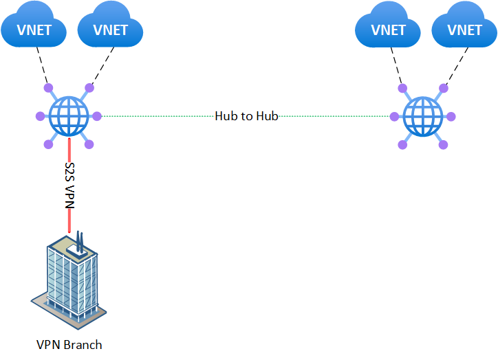

# Challenge 2

[< Previous Challenge](01_simple_vwan.md) - **[Home](../README.md)** - [Next Challenge >](03_isolated_vnets.md)

## Introduction

In this challenge, you will connect one of the hubs to a preconfigured VPN device simulating on-premises (branch).

## Description

* Configure VPN GW pre-deployed in the hub1 to connect to the VPN device.
* Use BGP for route propagation.
      * Use these tunnel parameters (custom IPSec configuration):

        ```text
        Link IP address / FQDN = 20.91.140.166 / jnthackpfsense.swedencentral.cloudapp.azure.com
        Link BGP address = 10.100.0.4
        Link ASN = 65504
        SA Lifetime in seconds = 10800
        IKE Phase 1 
            Encryption = AES256
            Integrity/PRF = SHA256
            DH Group = DHGroup14
        IKE Phase 2
            IPsec Encryption = GCMAES128
            IPsec Integrity = GCMAES128
            PFS Group = None
        ```

* Once configured, provide the coach with the public IP, default BGP IP for both VPN gateway instances, and the pre-shared key.
* Check the status of the tunnels and BGP
* Verify that the tunnel is working by pinging or opening ssh session to 10.100.0.36 (a VM located behind the on-premises VPN gateway).
* (bonus) Use pre-deployed route map to stop propagation of the 192.168.0.0/24 route from on-premises to Azure.

Sample topology:



## Success Criteria

* Confirm that the tunnels are established, routes from on-premises are being propagated via BGP to the hubs, and to the individual VMs in the spoke networks.
* Confirm connectivity between branches as well as between branches and VNets (same hub and across hubs)
* (bonus) Show that the 192.168.0.0/24 route is not being propagated, while all other routes are.

## Learning Resources

* [Tutorial: Create a site-to-site connection using Azure Virtual WAN](https://learn.microsoft.com/en-us/azure/virtual-wan/virtual-wan-site-to-site-portal)