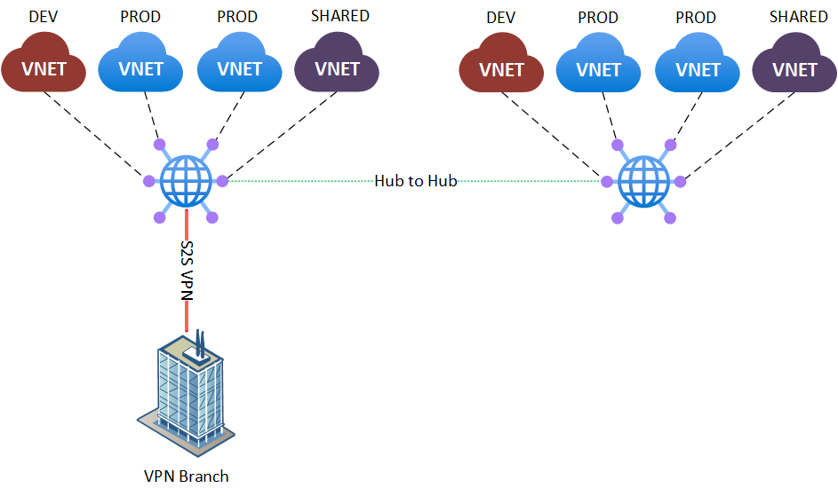

# Challenge 3

[< Previous Challenge](./02_branch_connectivity.md) - **[Home](../README.md)** - [Next Challenge >](./04_secured_hub.md)

## Introduction

This challenge will help you understand the custom routing feature of Virtual WAN by configuring routing in such a way that several VNets are isolated from each other.

## Description

* Deploy 2 more VNets on each hub with a VM in it. Make sure each hub has 4 VNets in total. Those 4 VNets in each hub will have different roles:
  * 1 VNet will be used for Development (DEV)
  * 2 VNets will be used for Production (PROD)
  * 1 VNet will be used for Common Services (SHARED)
* From a network perspective, this segmentation means that DEV can communicate with SHARED, but not with PROD. PROD can communicate with SHARED, but not with DEV. This also applies across hubs -  for example, a PROD VNet in one hub can communicate with another PROD VNet in a different hub, and so on. All spoke VNets can still communicate with on-premises.

Sample topology:

## Success Criteria

* VMs in DEV VNets can communicate with VMs in SHARED VNets (including across hubs) and with VMs on-premises. VMs in DEV VNets cannot communicate with VMs in PROD VNets.
* VMs in PROD VNets can communicate with VMs in SHARED VNets (including across hubs) and with VMs on-premises. VMs in PROD VNets cannot communicate with VMs in DEV VNets.
* VMs in SHARED VNets can communicate with all VMs in both hubs as well as with on-premises.

## Learning Resources

* [Virtual WAN custom routing ](https://docs.microsoft.com/azure/virtual-wan/about-virtual-hub-routing)
* [Scenario: Isolating VNets](https://docs.microsoft.com/azure/virtual-wan/scenario-isolate-vnets)
* [Tutorial: Scenario: Custom isolation for VNets](https://learn.microsoft.com/en-us/azure/virtual-wan/scenario-isolate-vnets-custom)