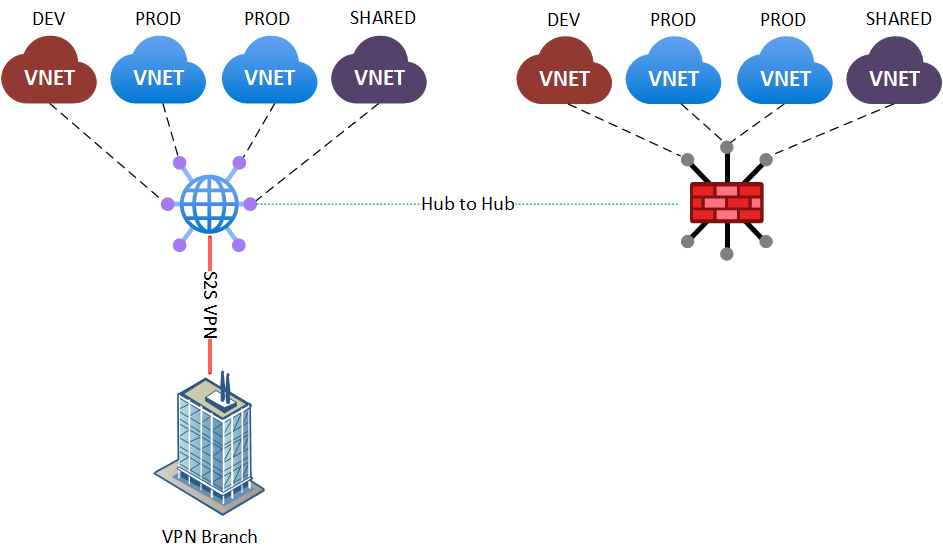

# Challenge 4

[< Previous Challenge](./03_isolated_vnets.md) - **[Home](../README.md)** - [Next Challenge >](./05_secured_publishing.md)

## Introduction

This challenge will introduce you to secured virtual hubs. These are Virtual WAN hubs where an Azure Firewall is deployed into. Routing can then be configured to ensure Azure Firewall can be leveraged to restrict traffic.

## Description

* Promote one of the hubs to a "secured hub" by deploying Azure Firewall.
* Adjust the routing so that traffic from VNETs to the internet passes through the firewall.
* On one of the VMs in the PROD spoke VNET, configure a web server and publish a simple web page.
* Make this page accessible from the internet. Use the azure firewall.

Sample topology:

## Success Criteria

* Demonstrate that some traffic from a VM in a SPOKE VNET is going to the internet through Azure Firewall.
* Demonstrate that some traffic from a VM in a SPOKE VNET is not reaching the internet through Azure Firewall because it is blocked by the firewall.
* Access the published page from the internet.

## Learning Resources

* [What is Azure Firewall?](https://learn.microsoft.com/en-us/azure/firewall/overview)
* [Azure Firewall Policy rule sets](https://learn.microsoft.com/en-us/azure/firewall/policy-rule-sets)
* [Monitor Azure Firewall](https://learn.microsoft.com/en-us/azure/firewall/monitor-firewall)
* [What is a secured virtual hub?](https://learn.microsoft.com/en-us/azure/firewall-manager/secured-virtual-hub)
* [Tutorial: Secure your virtual hub using Azure Firewall Manager](https://learn.microsoft.com/en-us/azure/firewall-manager/secure-cloud-network)
* [Scenario: Azure Firewall - custom](https://docs.microsoft.com/azure/virtual-wan/scenario-route-between-vnets-firewall)