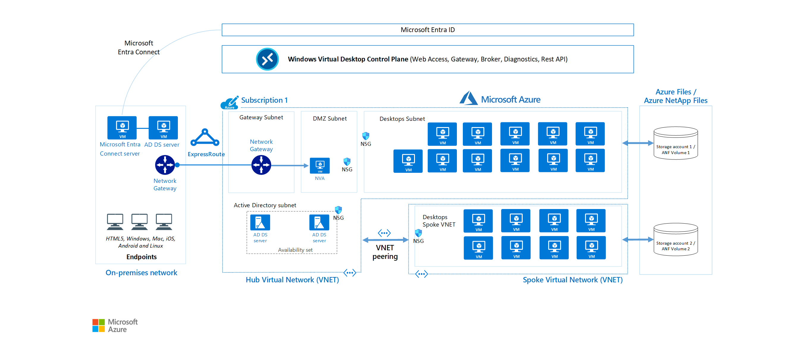

# Azure Virtual Desktop (AVD) Architecture Planning

## Introduction

This document outlines the architecture planning for Azure Virtual Desktop deployment. Planning your AVD environment carefully is crucial to ensure optimal performance, scalability, and cost-efficiency.

## Architecture Components

Azure Virtual Desktop consists of these key components:
- **Host Pools**: Collections of Azure VMs that register to AVD as session hosts
- **Session Hosts**: The virtual machines running within a host pool
- **Application Groups**: Logical groupings of applications installed on session hosts
- **Workspaces**: Logical groupings of application groups that users see when they connect

## Resources

To get an overview about the Azure Virtual Desktop service, read through these resources:

* [Azure Virtual Desktop Overview](https://learn.microsoft.com/en-us/azure/virtual-desktop/overview)
* [Azure Virtual Desktop Architecture](https://learn.microsoft.com/en-us/azure/virtual-desktop/service-architecture-resilience)
* [Azure Virtual Desktop Enterprise architecture](https://learn.microsoft.com/en-us/azure/architecture/example-scenario/azure-virtual-desktop/azure-virtual-desktop)

## Understand host pool types

There are 2 host pool types:

- **Pooled**
- **Personal**

Before moving on with the challenges, make sure to understand the difference between those 2 [AVD Host pools](https://learn.microsoft.com/en-us/azure/virtual-desktop/terminology)

## Next Steps

Continue with first real challenge - Deployment of Pooled host pools.